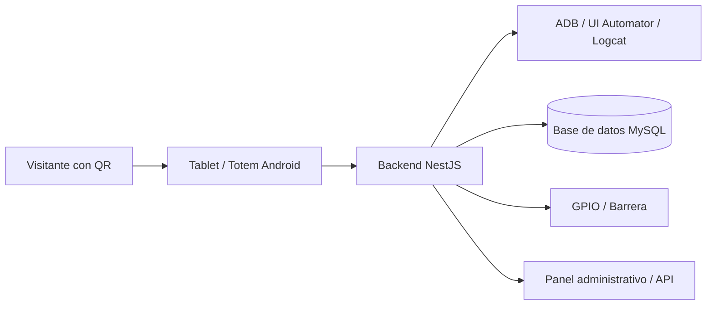

# Vision General Administrativa

## Proposito

Condovive Totem Backend es el servicio encargado de automatizar el registro de cruces en un entorno residencial.

Su funcion principal es operar como puente entre:

- la app Android del totem o tablet,
- la base de datos del sistema,
- los dispositivos fisicos de apertura,
- y los registros administrativos del acceso.

En terminos simples: el software mantiene el totem listo para escanear visitas, detecta cuando ocurre una lectura, interpreta si la visita debe aceptarse o denegarse, ejecuta la accion correspondiente y deja evidencia del cruce.

## Que resuelve

El sistema reduce la intervencion manual del guardia o administrador en el flujo repetitivo de registro de visitas.

Automatiza tareas como:

- preparar la tablet en la pantalla correcta para escaneo,
- escuchar eventos de camara generados por la app,
- leer la informacion visible de la visita,
- identificar si el resultado corresponde a aceptacion, rechazo o estado desconocido,
- activar una salida fisica mediante GPIO cuando corresponde,
- ejecutar la secuencia de botones necesaria en la app,
- guardar el resultado del cruce para consulta posterior,
- monitorear estado termico y bateria de los dispositivos.

## Vista Global

## Componentes Operativos

| Componente | Funcion |
| --- | --- |
| Backend NestJS | Expone API, arranca automatismos y coordina servicios. |
| Tablet Android | Ejecuta la app `com.condovive.guard` y muestra el flujo de visitas. |
| ADB | Permite controlar la tablet, leer la UI, tomar screenshots y escuchar logcat. |
| GPIO | Activa el pulso fisico para abrir una barrera o relevador. |
| MySQL | Guarda dispositivos, secuencias, usuarios, perfiles, logs termicos y registros de cruce. |
| Secuencias | Definen taps, swipes, esperas y delays configurables por dispositivo. |

## Resultado Administrativo

Cada evento de cruce puede dejar registro con:

- estado detectado: `aceptar visita`, `denegar visita` o `unknown`,
- anfitrion,
- unidad,
- co-anfitrion,
- visitante,
- telefono,
- correo,
- tipo de visita,
- XML crudo del UI dump para auditoria o diagnostico,
- fecha de registro.

## Alcance Actual

El proyecto actual esta centrado en automatizar un dispositivo activo a la vez, identificado en base de datos con `tagActive = 1`.

La API tambien permite administrar dispositivos, consultar listados, tomar screenshot del dispositivo activo, iniciar/detener/reiniciar el ciclo y registrar informacion termica.
