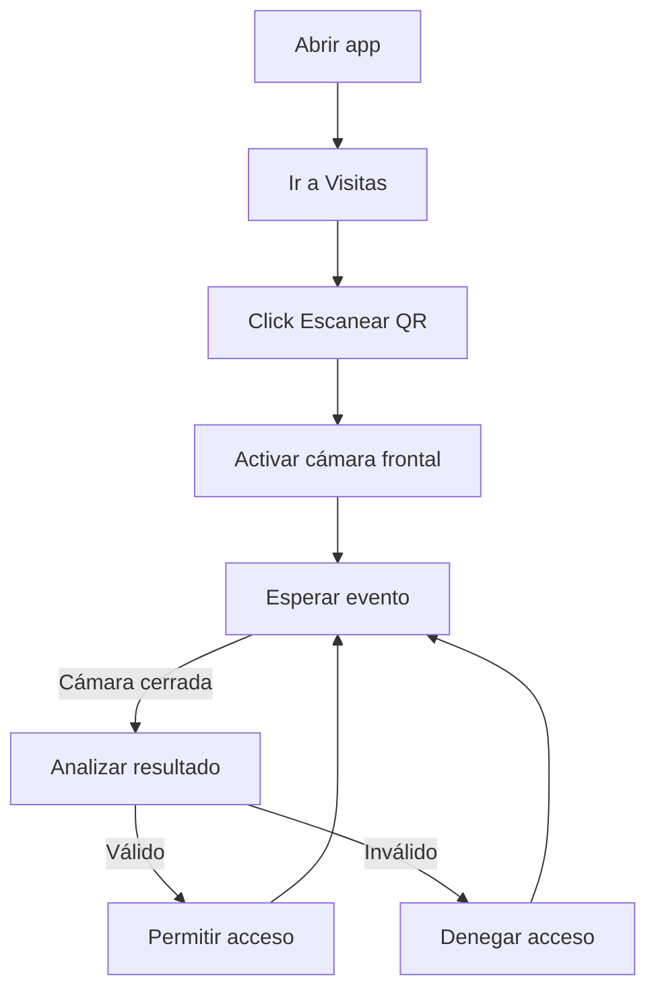
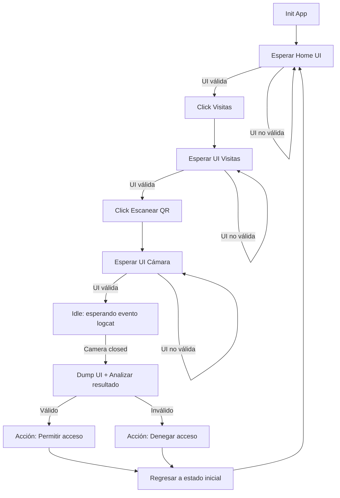

# Arquitectura Actual

```mermaid
flowchart TD

A[Abrir app] --> B[Ir a Visitas]
B --> C[Click Escanear QR]
C --> D[Activar cámara frontal]

D --> E[Esperar evento]
E -->|Cámara cerrada| F[Analizar resultado]

F -->|Válido| G[Permitir acceso]
F -->|Inválido| H[Denegar acceso]

G --> E
H --> E
```

# Nuevo Flujo determinista state-driven

```mermaid
flowchart TD

A[Init App] --> B[Esperar Home UI]

B -->|UI válida| C[Click Visitas]
B -->|UI no válida| B

C --> D[Esperar UI Visitas]
D -->|UI válida| E[Click Escanear QR]
D -->|UI no válida| D

E --> F[Esperar UI Cámara]
F -->|UI válida| G[Idle: esperando evento logcat]
F -->|UI no válida| F

G -->|Camera closed| H[Dump UI + Analizar resultado]

H -->|Válido| I[Acción: Permitir acceso]
H -->|Inválido| J[Acción: Denegar acceso]

I --> K[Regresar a estado inicial]
J --> K

K --> B
```
