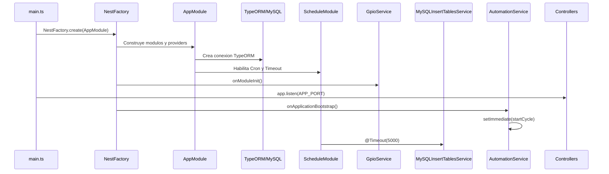
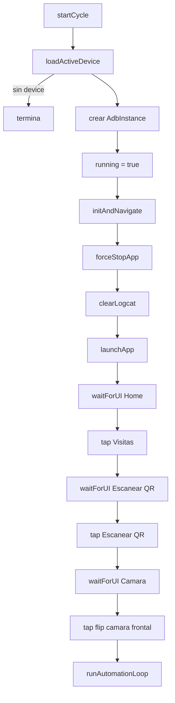
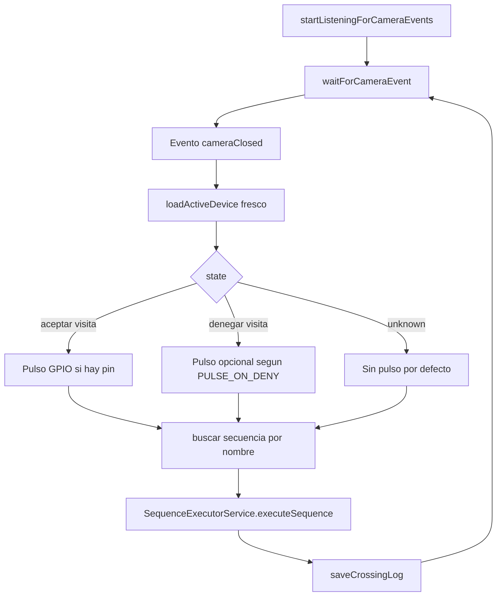

# Lifecycle y Arranque

Esta pagina describe quien llama a quien y en que momento.

## Secuencia de Arranque



## Orden Conceptual

1. `bootstrap()` crea la aplicacion Nest.
2. Nest resuelve imports, controllers y providers.
3. Se inicializa configuracion y base de datos.
4. Se habilita scheduler.
5. Providers con hooks de lifecycle ejecutan su inicializacion.
6. `main.ts` configura CORS y session.
7. `app.listen(APP_PORT)` deja la API disponible.
8. `AutomationService.onApplicationBootstrap()` agenda `startCycle()`.
9. `MySQLInsertTablesService.handleTimeout()` corre despues de 5 segundos para seed inicial.
10. `DevicesSchedule.monitorDevices()` queda programado cada 5 minutos.

## Lifecycle de `AutomationService`

`AutomationService` implementa `OnApplicationBootstrap`.

Su hook:

```ts
async onApplicationBootstrap() {
  setImmediate(() => {
    this.startCycle().catch(...)
  });
}
```

La intencion es que el ciclo automatico arranque despues de que Nest termino de levantar la aplicacion. `setImmediate` evita que el trabajo largo de ADB bloquee directamente el hook.

## Ciclo Principal de Automatizacion



## Loop de Eventos

`runAutomationLoop()` inicia el listener de logcat una sola vez y despues queda esperando eventos:



## Stop y Restart

`stopCycle()`:

- marca `running = false`,
- detiene el listener ADB con `adb.stopListening()`,
- limpia la instancia activa.

`restartCycle()`:

- llama `stopCycle()`,
- espera 1 segundo,
- llama `startCycle()`.

## Lifecycle de `GpioService`

`GpioService` implementa `OnModuleInit`.

Durante `onModuleInit()`:

- detecta arquitectura con `process.arch`,
- si corre en ARM intenta cargar `onoff`,
- busca dispositivos habilitados,
- inicializa los pines en estado alto (`writeSync(1)`),
- si no hay hardware compatible, trabaja en modo simulacion.

## Lifecycle de Jobs Programados

`MySQLInsertTablesService` usa `@Timeout(5000)` para inicializar data base despues del arranque.

`DevicesSchedule` usa `@Cron('0 */5 * * * *')`, por lo que corre cada 5 minutos en el segundo 0.

## Punto Importante

Hay dos mundos corriendo al mismo tiempo:

- **HTTP/API**: controllers disponibles para frontend, administracion o pruebas manuales.
- **Automatizacion viva**: loop en memoria esperando eventos de ADB/logcat y ejecutando acciones fisicas.

Por eso el manejo de estado en `AutomationService` (`running`, `adb`) es el centro operativo del sistema.
