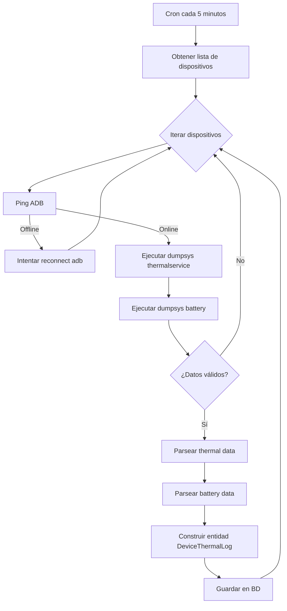

# Device Schedule

El módulo **DeviceSchedule** es un job programado (cron) encargado de:

- Monitorear dispositivos Android vía Android Debug Bridge (ADB)
- Verificar conectividad
- Obtener métricas térmicas y de batería
- Persistir logs en base de datos

Se ejecuta de forma periódica cada 5 minutos, actuando como un recolector centralizado de telemetría.

